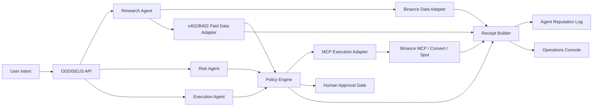

# ODDISEUS - Binance Agent OS Mini Hackathon Implementation Plan

## One-Line Thesis

ODDISEUS is the control and settlement layer for financial AI agents: it lets agents discover tools, buy data, use Binance MCP, request testnet execution, and leave verifiable receipts without giving the model uncontrolled financial power.

## Hackathon Track

Primary target: Track B - Connect your Agent to MCP.

Why: the demo should visibly connect to Binance MCP testnet, read live/testnet market and risk data where available, and execute a tightly scoped testnet trade or convert action. The differentiator is that ODDISEUS is infrastructure, not a single trading bot.

Fallback: Track A - Agent Creation, only if Binance MCP testnet access is technically blocked before submission.

Submission X handle: https://x.com/0xjh0n

## Product Positioning

Tagline options:

- The clearing layer for financial agents.
- Let agents act. Make every action clearable.
- Agent-native permissions, payments, execution, and receipts.
- The testnet proving ground for agentic finance.

Buyer/user:

- AI-agent builders who want to connect to financial tools without unsafe key exposure.
- Funds and trading teams experimenting with research/execution agents.
- MCP server builders who want paid tool usage plus reputation.
- Exchanges, wallets, and fintechs that need auditable agent action logs.

Category:

- Agent financial infrastructure.
- MCP/x402 control plane.
- Agent execution governance.

## Demo Story

The demo must feel like infrastructure operating live.

1. A user gives an intent: "Find a low-risk BTC opportunity using a max 10 USDT budget. Buy external alpha only if it is cheap and justified."
2. A Research Agent requests market context through Binance public/MCP tools.
3. The system reads live Binance data:
   - spot best bid/ask
   - futures mark price
   - funding rate
   - open interest
   - top-trader long/short ratio
   - ADL risk
4. If confidence is low, the Research Agent requests a paid external signal through an x402/B402-style endpoint.
5. ODDISEUS checks policy before paying:
   - allowed endpoint
   - max data spend
   - valid merchant
   - max response size
   - no duplicate payment
6. A Risk Agent evaluates the purchased signal against Binance live data.
7. An Execution Agent proposes one action:
   - preferred: Binance Convert or Spot micro-trade through MCP
   - fallback: explicit blocked receipt if testnet credentials or permissions are missing
8. ODDISEUS runs a pre-flight check:
   - symbol allowlist
   - max notional
   - spread bound
   - funding/risk threshold
   - user confirmation threshold
9. The action is executed or blocked.
10. The system generates a receipt:
    - intent hash
    - agents involved
    - tool calls
    - data purchased
    - market snapshot
    - policy decision
    - execution result or blocked proof
    - final status
11. The receipt updates agent reputation locally, with an ERC-8004-compatible shape for future on-chain publication.

## MVP Scope

Build a polished local web app plus backend control plane with real testnet execution as the main path.

Required for submission:

- React/Vite frontend with a live operations console.
- Node backend with agent orchestration endpoints.
- Binance market-data adapter using available Binance tools or public API.
- MCP testnet execution adapter, with authenticated setup documented and isolated.
- x402/B402 testnet payment path where available; local 402 harness is allowed only as a development harness, not the submission claim.
- Policy engine with deterministic allow/deny/escalate decisions.
- Receipt builder with hashable JSON.
- Demo mode that runs end-to-end on testnet with no real funds.
- Submission README, architecture diagram, demo script, and X post draft.

Stretch:

- Public deployment.
- ERC-8004-compatible agent registration JSON.

Out of scope for hackathon:

- Mainnet trading or any real-money execution.
- Autonomous futures trading with leverage.
- Withdrawals.
- Custody of user private keys.
- Production compliance claims.
- Promises of profit or investment advice.

## Architecture



## Core Modules

### 1. Operations Console

Purpose: make the infrastructure understandable in 90 seconds.

Views:

- Intent panel: user request, budget, mode, asset.
- Agent lane: Research, Risk, Execution, Clearing.
- Live market panel: Binance metrics.
- Policy panel: allow/deny/escalate checks.
- Payment panel: paid data request and receipt.
- Execution panel: proposed action, testnet result, or blocked proof.
- Final receipt: downloadable JSON and visual summary.

Design direction:

- Dense infrastructure dashboard, not landing-page marketing.
- Dark operational theme with Binance yellow as accent, but avoid one-note yellow/black.
- Timeline of decisions as the primary visual.
- Clear status chips: OBSERVED, PAID, CHECKED, CLEARED, EXECUTED, BLOCKED.

### 2. Agent Orchestrator

Endpoint draft:

- `POST /api/runs` creates a run from user intent.
- `GET /api/runs/:id` returns current state.
- `POST /api/runs/:id/step` advances one deterministic demo step.
- `POST /api/runs/:id/approve` approves an escalated action.
- `GET /api/runs/:id/receipt` returns final receipt JSON.

Agents are implemented as deterministic workers first, with optional LLM narrative later.

### 3. Binance Adapter

Market data to collect:

- `BTCUSDT` spot book ticker.
- `BTCUSDT` futures book ticker.
- mark price and funding.
- open interest.
- top-trader long/short ratio.
- ADL risk.
- recent trades sample.

Execution adapter:

- `quoteTestnetAction(intent)` for testnet quote and pre-flight checks.
- `executeViaMcpTestnet(action)` for Track B execution.
- `recordExecutionProof(action, response)` for receipt generation.

### 4. Paid Data Adapter

Hackathon demo version:

- Local endpoint returns HTTP 402-style payment challenge.
- ODDISEUS policy approves payment if price <= configured data budget.
- Backend records the paid-intelligence response after the testnet payment or records a blocked proof when the dependency is missing.
- Receipt records payment challenge, payment proof hash, merchant, price, and payload hash.

This is a development fallback. The target submission path should use testnet payment if Binance B402/x402 testnet is accessible in time.

Upgrade path:

- Replace local development harness with Binance B402/x402 endpoint.
- Add Bazaar discovery.
- Add merchant reputation scoring.

### 5. Policy Engine

Initial policy schema:

```json
{
  "agentId": "execution-agent",
  "maxRunBudgetUsdt": "10.00",
  "maxPaidDataUsdt": "0.25",
  "allowedSymbols": ["BTCUSDT", "ETHUSDT", "BNBUSDT"],
  "allowedActions": ["READ_MARKET", "BUY_DATA", "TESTNET_SPOT", "TESTNET_CONVERT"],
  "realExecutionRequiresApproval": true,
  "maxSpreadBps": 12,
  "maxFundingRateAbs": "0.0005",
  "denyIfAdlRisk": ["HIGH"],
  "denyWithdrawals": true,
  "denyLeverage": true
}
```

Decision types:

- `ALLOW`: action can proceed.
- `ESCALATE`: user approval required.
- `DENY`: action blocked with machine-readable reason.

### 6. Receipt Layer

Receipt shape:

```json
{
  "receiptVersion": "oddiseus-v0.1",
  "runId": "run_...",
  "createdAt": "2026-09-02T00:00:00.000Z",
  "intentHash": "sha256:...",
  "agents": [],
  "marketSnapshot": {},
  "paidData": [],
  "policyDecisions": [],
  "execution": {},
  "outcome": "TESTNET_EXECUTED_OR_BLOCKED",
  "receiptHash": "sha256:..."
}
```

The receipt must be deterministic and independently verifiable from the saved run state.

### 7. Reputation Log

Local MVP:

- Each agent gets a scorecard:
  - completed runs
  - denied actions
  - escalations
  - policy violations attempted
  - average data cost
  - successful cleared executions

ERC-8004-compatible future:

- `agent.json` with identity, service endpoint, supported capabilities, and validation method.
- feedback event derived from receipts.

## Implementation Timeline

Current date: 2026-09-02.
Submission deadline: 2026-09-08 23:59 UTC / 2026-09-08 18:59 Bogota.

### Day 1 - Concept Lock And Skeleton

- Create `oddiseus` project.
- Scaffold Vite React app and Node API.
- Implement static dashboard shell.
- Implement run state machine with deterministic development data while adapters are being wired.
- Write README thesis and demo narrative.

Exit criteria:

- App opens locally.
- One development run advances through all stages.
- Receipt JSON is generated.

### Day 2 - Live Binance Data

- Add Binance adapter for public market data.
- Display live BTCUSDT metrics.
- Add risk rules using spread, funding, open interest, long/short ratio, and ADL risk.
- Store market snapshots in receipt.

Exit criteria:

- Demo uses real Binance data.
- Policy decisions reference actual numbers.

### Day 3 - Paid Data / x402 Testnet

- Implement local 402 challenge flow as development harness.
- Add paid alpha endpoint.
- Add policy gate for data purchase.
- Hash paid payload into receipt.
- Add payment lane UI.
- Attempt Binance B402/x402 testnet path.

Exit criteria:

- Agent requests paid alpha.
- Clearing approves/denies payment.
- Receipt includes paid data proof.
- Testnet path is documented as connected or blocked with reason.

### Day 4 - Execution Adapter

- Implement Convert/Spot testnet execution path.
- Add MCP execution interface.
- Attempt Binance MCP testnet authenticated setup.
- Add human approval gate.

Exit criteria:

- Full run ends in testnet execution or policy block with proof.
- Real MCP testnet micro-action is available behind explicit approval.

### Day 5 - Polish And Infrastructure Narrative

- Improve UI transitions and states.
- Add architecture diagram.
- Add downloadable receipt.
- Add agent reputation page.
- Add ERC-8004-compatible `agent.json`.

Exit criteria:

- Judges can understand the platform without explanation.
- Demo feels like infrastructure, not a chatbot.

### Day 6 - Verification

- Add tests for policy engine and receipt hashing.
- Add deterministic demo seed.
- Run build and smoke tests.
- Prepare deployment if needed.
- Capture screenshots.

Exit criteria:

- No broken demo path.
- Receipts are reproducible.
- Build passes.

### Day 7 - Submission

- Record 2-3 minute video.
- Write X reply/quote post.
- Prepare GitHub README.
- Complete Binance survey.
- Submit before deadline.

Exit criteria:

- Video, repo, demo link, and form are complete.

## Technical Stack

Preferred:

- Frontend: React + Vite.
- Backend: Node.js with simple API routes or Express.
- State: JSON files or SQLite for hackathon speed.
- Tests: Node test runner or Vitest.
- Hashing: built-in Node `crypto`.
- Charts: lightweight custom components or Recharts if already convenient.

Avoid:

- Heavy database setup unless needed.
- Over-complex multi-agent frameworks.
- Real fund handling before the demo path is deterministic.

## Judging Hooks

What judges should remember:

- Binance gives agents access to financial rails; ODDISEUS makes those actions governable.
- x402/B402 lets agents buy tools/data; ODDISEUS decides when that is allowed.
- MCP gives agents capabilities; ODDISEUS gives capability boundaries.
- Receipts make every agent action inspectable.
- Reputation turns isolated runs into an agent economy.

Demo punchline:

> This is not a trading bot. This is the missing clearing layer between AI agents and financial infrastructure.

## Risk Register

### Eligibility Risk

Binance restrictions may prevent live trading depending on account, region, or product access.

Mitigation:

- Use public market data and Binance testnet execution.
- Keep Track A fallback ready.
- Do not claim production eligibility.

### Real Funds Risk

Autonomous trading can create financial loss.

Mitigation:

- Default demo is testnet-only, no-real-funds.
- Real execution requires explicit manual approval.
- Use testnet micro amounts only.
- No futures/leverage in hackathon MVP.

### Scope Risk

Trying to build full agent economy infrastructure in 7 days is too broad.

Mitigation:

- Build one vertical run: BTCUSDT market observation -> paid signal -> policy -> testnet execution -> receipt.
- Make the architecture imply scale without implementing every adapter.

### Narrative Risk

It may sound like a wrapper around Binance MCP.

Mitigation:

- Emphasize clearing, paid tool routing, receipts, and reputation.
- Make policy and receipt the center of the UI.

## First Build Tasks

1. Scaffold app.
2. Implement run state machine.
3. Implement policy engine.
4. Implement receipt hashing.
5. Add live Binance market adapter.
6. Add UI timeline.
7. Add paid data testnet/harness adapter.
8. Add testnet execution adapter.
9. Add README and demo script.
10. Add tests and screenshots.

## Submission Assets

Required:

- GitHub repo.
- Demo video.
- X handle URL.
- Track selection.
- Submission form.

Likely fields:

- Project name: ODDISEUS.
- Short description: ODDISEUS is the clearing layer for financial AI agents, governing Binance MCP testnet execution, x402/B402 paid data, policy checks, receipts, and agent reputation.
- Track: Track B - Connect your Agent to MCP.
- Repo: TBD.
- Demo: TBD.
- Video: TBD.
